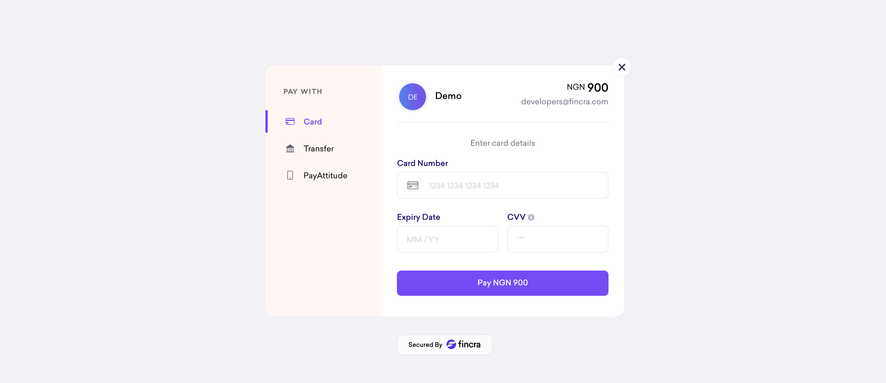

# Laravel Fincra

[](https://packagist.org/packages/prevailexcel/laravel-fincra)
[](https://packagist.org/packages/prevailexcel/laravel-fincra)

A Laravel Package for working with Fincra Payments seamlessly.

Fincra offers a contemporary financial infrastructure designed for businesses and developers, enabling them to facilitate local and international payouts, gather payments from customers, and create virtual accounts.

This package allows you to:
- Accept payments via Checkout (Pop widget & Redirect)
- Create and manage virtual accounts
- Process local and international payouts
- Manage beneficiaries
- Verify identities (BVN, Account Numbers)
- Handle webhooks with verification
- And much more!




## Requirements

[PHP](https://php.net) 7.4+ or [PHP](https://php.net) 8.0+, and [Composer](https://getcomposer.org) are required.

## Installation

To get the latest version of Laravel Fincra, simply require it:

```bash
composer require prevailexcel/laravel-fincra
```

Or add the following line to the require block of your `composer.json` file:

```json
"prevailexcel/laravel-fincra": "1.0.*"
```

You'll then need to run `composer install` or `composer update` to download it and have the autoloader updated.

### Service Provider & Facade (Laravel < 5.5)

Once Laravel Fincra is installed, you need to register the service provider. Open up `config/app.php` and add the following to the `providers` key:

```php
'providers' => [
    ...
    PrevailExcel\Fincra\FincraServiceProvider::class,
    ...
]
```

Also, register the Facade:

```php
'aliases' => [
    ...
    'Fincra' => PrevailExcel\Fincra\Facades\Fincra::class,
    ...
]
```

> If you use **Laravel >= 5.5** you can skip this step and go to [**configuration**](#configuration)

## Configuration

You can publish the configuration file using this command:

```bash
php artisan vendor:publish --provider="PrevailExcel\Fincra\FincraServiceProvider"
```

A configuration-file named `fincra.php` with sensible defaults will be placed in your `config` directory:

```php
<?php

return [
    /**
     * Public Key From Fincra Dashboard
     */
    'publicKey' => getenv('FINCRA_PUBLIC_KEY'),

    /**
     * Secret Key From Fincra Dashboard
     */
    'secretKey' => getenv('FINCRA_SECRET_KEY'),

    /**
     * Business ID From Fincra Dashboard
     */
    'businessId' => getenv('FINCRA_BUSINESS_ID'),

    /**
     * Webhook Secret for verifying webhooks
     */
    'webhookSecret' => getenv('FINCRA_WEBHOOK_SECRET'),

    /**
     * Environment: sandbox or live
     */
    'env' => env('FINCRA_ENV', 'sandbox'),

    /**
     * Fincra Sandbox URL
     */
    'sandboxUrl' => env('FINCRA_SANDBOX_URL', 'https://sandboxapi.fincra.com'),

    /**
     * Fincra Live URL
     */
    'liveUrl' => env('FINCRA_LIVE_URL', 'https://api.fincra.com'),

];
```

### Environment Variables

Open your `.env` file and add your Fincra API keys:

```env
FINCRA_PUBLIC_KEY=pk_test_****************************
FINCRA_SECRET_KEY=sk_test_****************************
FINCRA_BUSINESS_ID=****************************
FINCRA_WEBHOOK_SECRET=****************************
FINCRA_ENV=sandbox
```

> **Note:** Remember to change `FINCRA_ENV` to `live` and update the keys when you're in production.

## Usage

### Payment Flow Overview

1. Collect payment information from your customer
2. Initialize payment using either:
   - **Inline Checkout** (Pop Widget) - User pays without leaving your site
   - **Checkout Redirect** - Redirect user to Fincra hosted page
3. Verify the transaction
4. Handle webhook notifications

### Routes Setup

Add these routes to handle payments:

```php
Route::post('/pay', [PaymentController::class, 'redirectToGateway'])->name('pay');
Route::callback(PaymentController::class, 'handleGatewayCallback');
Route::webhook(WebhookController::class, 'handleWebhook');
```

## Checkout Methods

### 1. Inline Checkout (Pop Widget)

The inline checkout displays a payment modal on your page, allowing customers to pay without leaving your site.

#### Controller Example

```php
<?php

namespace App\Http\Controllers;

use Illuminate\Http\Request;
use PrevailExcel\Fincra\Facades\Fincra;

class PaymentController extends Controller
{
    /**
     * Display checkout widget
     */
    public function redirectToGateway()
    {
        try {
            return Fincra::payWithWidget();
        } catch (\Exception $e) {
            return redirect()->back()->withMessage([
                'msg' => $e->getMessage(), 
                'type' => 'error'
            ]);
        }
    }

    /**
     * Handle callback from widget
     */
    public function handleGatewayCallback()
    {
        $paymentDetails = fincra()->getPaymentData();
        
        // Process payment details
        // Mark order as paid, send email, etc.
        
        dd($paymentDetails);
    }
}
```

#### Blade Form

```html
<form method="POST" action="{{ route('pay') }}">
    @csrf
    <div class="form-group">
        <label for="name">Full Name</label>
        <input class="form-control" type="text" name="name" required />
    </div>
    
    <div class="form-group">
        <label for="email">Email</label>
        <input class="form-control" type="email" name="email" required />
    </div>
    
    <div class="form-group">
        <label for="phoneNumber">Phone Number</label>
        <input class="form-control" type="tel" name="phoneNumber" required />
    </div>
    
    <div class="form-group">
        <label for="amount">Amount</label>
        <input class="form-control" type="number" name="amount" required />
    </div>
    
    <input type="hidden" name="currency" value="NGN" />
    <input type="hidden" name="reference" value="{{ uniqid() }}" />
    
    <div class="form-submit">
        <button class="btn btn-primary" type="submit">Pay Now</button>
    </div>
</form>
```

### 2. Checkout Redirect

Redirect users to Fincra's hosted checkout page:

```php
public function redirectToGateway()
{
    try {
        $data = [
            'amount' => request()->amount,
            'currency' => 'NGN',
            'customer' => [
                'name' => request()->name,
                'email' => request()->email,
                'phoneNumber' => request()->phoneNumber,
            ],
            'paymentMethods' => ['card', 'bank_transfer', 'payattitude'],
            'feeBearer' => 'customer',
            'reference' => uniqid('ref_'),
            'redirectUrl' => route('payment.callback'),
        ];

        return Fincra::checkoutRedirect($data)->redirectNow();
        
        // Or for API, return the link:
        // return Fincra::checkoutRedirect($data, true);
        
    } catch (\Exception $e) {
        return back()->with('error', $e->getMessage());
    }
}
```

## Virtual Accounts

### Create Virtual Account

```php
// Create Temporary Virtual Account
$data = [
    'currency' => 'NGN',
    'accountType' => 'individual',
    'accountName' => 'John Doe',
    'bvn' => '12345678901', // Required for Nigerian accounts
    'meansOfId' => [
        [
            'type' => 'identityCard',
            'number' => 'A1234567890',
        ]
    ],
];

$virtualAccount = Fincra::createVirtualAccount($data);

// Create Permanent Virtual Account
$data['isPermanent'] = true;
$permanentAccount = Fincra::createVirtualAccount($data);
```

### Get Virtual Accounts

```php
// Get all virtual accounts
$accounts = Fincra::getVirtualAccounts();

// Get single virtual account
$account = Fincra::getVirtualAccount($virtualAccountId);

// Get virtual account requests
$requests = Fincra::getVirtualAccountRequests();
```

## Payouts

### Initiate Payout

```php
$data = [
    'sourceCurrency' => 'NGN',
    'destinationCurrency' => 'NGN',
    'amount' => 10000,
    'business' => config('fincra.businessId'),
    'description' => 'Payment for services',
    'beneficiary' => [
        'firstName' => 'John',
        'lastName' => 'Doe',
        'email' => '[email protected]',
        'phoneNumber' => '+2348012345678',
        'accountHolderName' => 'John Doe',
        'accountNumber' => '1234567890',
        'type' => 'individual',
        'bankCode' => '058', // GTBank
        'country' => 'NG',
    ],
    'paymentDestination' => 'bank_account',
];

$payout = Fincra::initiatePayout($data);
```

### Get Payouts

```php
// Get all payouts
$payouts = Fincra::getPayouts();

// Get single payout
$payout = Fincra::getPayout($payoutId);

// Get payout by reference
$payout = Fincra::getPayoutByReference($reference);
```

## Beneficiaries

```php
// Create beneficiary
$data = [
    'firstName' => 'John',
    'lastName' => 'Doe',
    'email' => '[email protected]',
    'phoneNumber' => '+2348012345678',
    'accountHolderName' => 'John Doe',
    'bank' => [
        'name' => 'GTBank',
        'code' => '058',
        'accountNumber' => '1234567890',
    ],
    'type' => 'individual',
    'currency' => 'NGN',
    'paymentDestination' => 'bank_account',
    'destinationAddress' => 'Lagos, Nigeria',
];

$beneficiary = Fincra::createBeneficiary($data);

// Get all beneficiaries
$beneficiaries = Fincra::getBeneficiaries();

// Get single beneficiary
$beneficiary = Fincra::getBeneficiary($beneficiaryId);

// Update beneficiary
$updated = Fincra::updateBeneficiary($beneficiaryId, $data);

// Delete beneficiary
$deleted = Fincra::deleteBeneficiary($beneficiaryId);
```

## Identity Verification

### Verify BVN

```php
$verification = Fincra::verifyBvn($bvn);
```

### Verify Bank Account

```php
$data = [
    'accountNumber' => '1234567890',
    'bankCode' => '058',
];

$verification = Fincra::verifyBankAccount($data);
```

### Verify IBAN

```php
$verification = Fincra::verifyIban($iban);
```

### BIN Resolution

```php
$binInfo = Fincra::resolveBin($bin);
```

## Balance & Transactions

```php
// Get balance
$balance = Fincra::getBalance();

// Get balance by currency
$balance = Fincra::getBalance('NGN');

// Get all transactions
$transactions = Fincra::getTransactions();

// Get single transaction
$transaction = Fincra::getTransaction($transactionId);
```

## Conversions

```php
// Create conversion quote
$data = [
    'sourceCurrency' => 'NGN',
    'destinationCurrency' => 'USD',
    'amount' => 100000,
];

$quote = Fincra::createConversion($data);

// Get conversion rate
$rate = Fincra::getConversionRate('NGN', 'USD');
```

## Webhooks

### Setup Webhook Handler

```php
<?php

namespace App\Http\Controllers;

use Illuminate\Http\Request;

class WebhookController extends Controller
{
    public function handleWebhook()
    {
        // Verify and get webhook data
        fincra()->getWebhookData()->processData(function ($data) {
            // Process the webhook data
            logger('Fincra Webhook:', $data);
            
            $event = $data['event'] ?? null;
            
            switch ($event) {
                case 'charge.successful':
                    // Handle successful charge
                    $this->handleSuccessfulCharge($data);
                    break;
                    
                case 'charge.failed':
                    // Handle failed charge
                    $this->handleFailedCharge($data);
                    break;
                    
                case 'payout.successful':
                    // Handle successful payout
                    $this->handleSuccessfulPayout($data);
                    break;
                    
                case 'virtual_account.credited':
                    // Handle virtual account credit
                    $this->handleVirtualAccountCredit($data);
                    break;
            }
            
            // Dispatch queued jobs for heavy operations
            // ProcessPaymentJob::dispatch($data);
        });
        
        // Acknowledge receipt
        return response()->json(['status' => 'success'], 200);
    }
    
    protected function handleSuccessfulCharge($data)
    {
        // Your logic here
    }
}
```

### CSRF Exception

Add the webhook route to the CSRF exception array in `app/Http/Middleware/VerifyCsrfToken.php`:

```php
protected $except = [
    'fincra/webhook',
];
```

### Webhook Events

Fincra sends webhooks for these events:

- `charge.successful` - Payment completed successfully
- `charge.failed` - Payment failed
- `payout.successful` - Payout completed
- `payout.failed` - Payout failed
- `virtual_account.credited` - Virtual account received payment
- `conversion.successful` - Currency conversion completed

## Available Methods

### Payments/Collections

```php
Fincra::payWithWidget(?array $data);
Fincra::checkoutRedirect(?array $data, bool $returnLink = false);
Fincra::verifyPayment(?string $reference);
Fincra::getPaymentData();
```

### Virtual Accounts

```php
Fincra::createVirtualAccount(array $data);
Fincra::getVirtualAccounts();
Fincra::getVirtualAccount(string $id);
Fincra::getVirtualAccountRequests();
Fincra::updateVirtualAccount(string $id, array $data);
Fincra::deleteVirtualAccount(string $id);
```

### Payouts

```php
Fincra::initiatePayout(array $data);
Fincra::getPayouts();
Fincra::getPayout(string $id);
Fincra::getPayoutByReference(string $reference);
Fincra::cancelPayout(string $id);
```

### Beneficiaries

```php
Fincra::createBeneficiary(array $data);
Fincra::getBeneficiaries();
Fincra::getBeneficiary(string $id);
Fincra::updateBeneficiary(string $id, array $data);
Fincra::deleteBeneficiary(string $id);
```

### Identity Verification

```php
Fincra::verifyBvn(string $bvn);
Fincra::verifyBankAccount(array $data);
Fincra::verifyIban(string $iban);
Fincra::resolveBin(string $bin);
```

### Balance & Transactions

```php
Fincra::getBalance(?string $currency);
Fincra::getTransactions();
Fincra::getTransaction(string $id);
```

### Conversions

```php
Fincra::createConversion(array $data);
Fincra::getConversions();
Fincra::getConversionRate(string $from, string $to);
```

### Webhooks

```php
Fincra::getWebhookData();
```

### Utilities

```php
Fincra::getBanks(?string $country);
Fincra::getCurrencies();
Fincra::getCountries();
```

## Changelog

Please see [CHANGELOG](CHANGELOG.md) for more information what has changed recently.

## Contributing

Please feel free to fork this package and contribute by submitting a pull request to enhance the functionalities.

## Security

If you discover any security related issues, please email prevailexcellent@gmail.com instead of using the issue tracker.

## Credits

- [Chimeremeze Prevail Ejimadu](https://github.com/prevailexcel)
- [All Contributors](../../contributors)

## License

The MIT License (MIT). Please see [License File](LICENSE.md) for more information.

## Support

For support, please reach out via:
- Email: prevailexcellent@gmail.com
- X/Twitter: [@EjimaduPrevail](https://twitter.com/EjimaduPrevail)
- LinkedIn: [Chimeremeze Prevail Ejimadu](https://www.linkedin.com/in/chimeremeze-prevail-ejimadu-3a3535219/)

Also check out my page on medium to catch articles and tutorials on Laravel [follow me on medium](https://medium.com/@prevailexcellent)!

Thanks!
Chimeremeze Prevail Ejimadu.

---

**Show some ❤️ by starring this repository!**